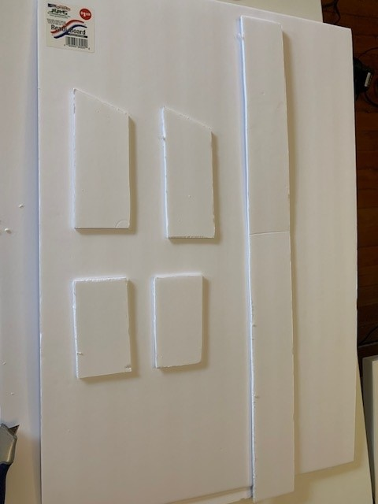

# What The Duck

This is an awesome project to make a glider!

This Glider is designed with dihedral in the wings, which makes it's handling very nice. Dihedral makes the airpane want to track straight, and it does this via angled wings and gravity (think of a leaf falling off a tree, going back and forth like a pendulum as it's on it's way to the ground. Since the airplane has a servomechanism paired to it's rudder surface, it can be controlled midair to turn and bank. 

## Photos

This is the final product, continue reading to see how it was made!

## Build Process

