# What The Duck

This is an awesome project to make a glider!

This Glider is designed with dihedral in the wings, which makes it's handling very nice. Dihedral makes the airpane want to track straight, and it does this via angled wings and gravity (think of a leaf falling off a tree, going back and forth like a pendulum as it's on it's way to the ground. Since the airplane has a servomechanism paired to it's rudder surface, it can be controlled midair to turn and bank. 

## Photos

This is the final product, continue reading to see how it was made!

## Build Process

These are the first cuts I made, they will form the body and the cockpit of the airplane. 

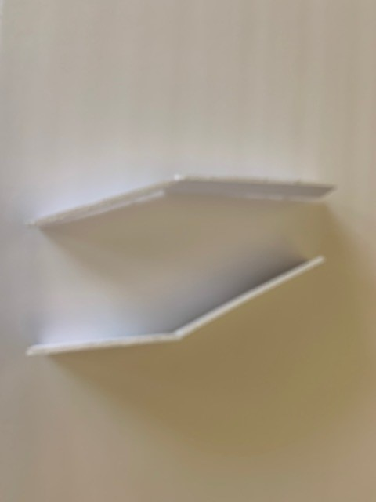

This is a mock up of the cockpit structure.

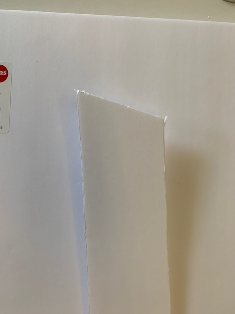

This shows a cut I made to the nose of the airplane, in order for it to line up with the cockpit angle.

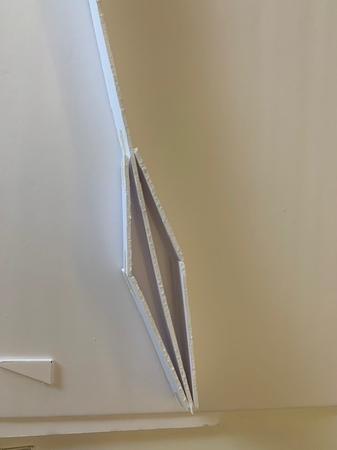

Here is a sneak peak of how the cockpit will look, without any electronics in it.

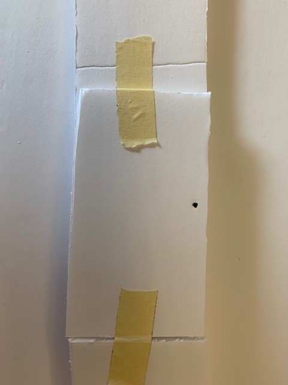

This shows how I taped the cockpit bends of the glider in preparation for gluing them.

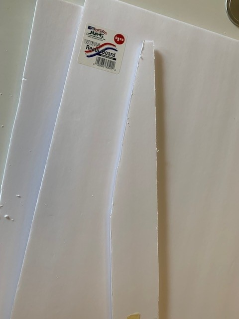 ''

This is the cut I made on the back of the glider, simply for aesthetic reasons. The glider would work just fine without this cut being made. In fact, the glider would fly better with the cut not have been made. That back surface of the fuselage is important for yaw stability, and cutting some of it off takes away a part of that stability.

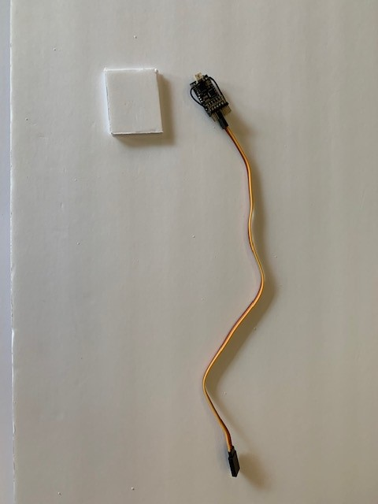

This is the receiver that my controller talks to. This is what will actuate the servomechanism. In this picture, the lithium-polymer battery is not shown. Said battery powers the receiver and the servo. It is roughly the size of the receiver. Also in the picture is the small foam platform that the receiver will sit on inside the airplane. 

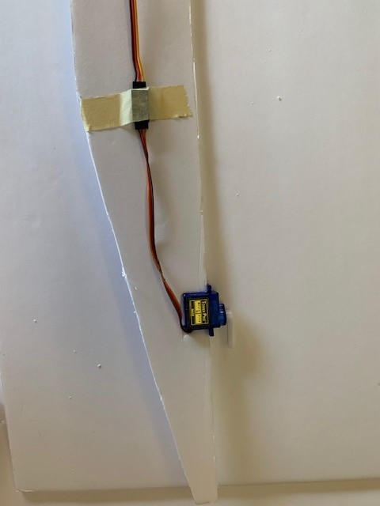

This is the servo sitting in it's cut spot at the back of the airplane. It's wire is taped to the back of the plane to keep it out of the way.

The electronics are in the airplane, and the battery and receiver is sitting on it's tray at the precut hole in the front of the airplane. 

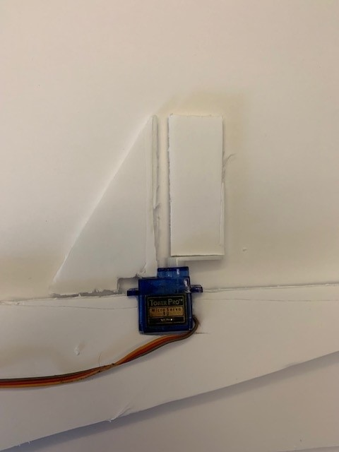

The servomechanism now has a surface that is cut out, and said surface will be attatched to the servo arm directly, so there is no instability in the control method of the glider. 

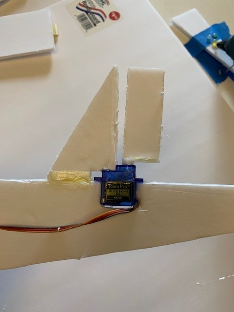

This is the glued and attatched surface (back), as well as the stationary flight surface (front) meant simply for stability.

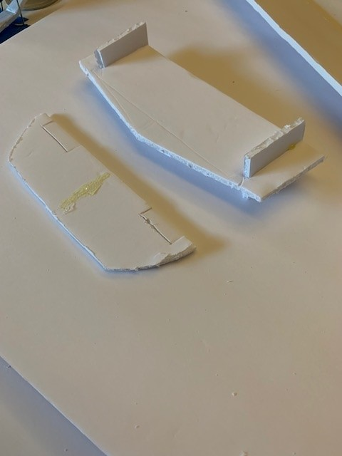

These are two tail designs I made, and one of them is designed to help with adverse yaw that could be introduced from wind or an imperfect throw. This surface is known as the elevator, or horizontal stab. With the larger stab, I included two extra rudder surfaces, or vertical stab(s).

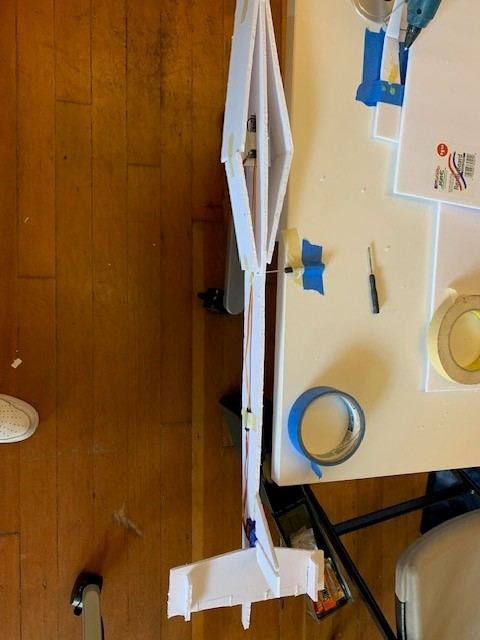

This is the glider attatched to a small screwdriver, which is attatched to the table. This was made to test the balance of the glider. Balance is extremely important when designing something with wings. 

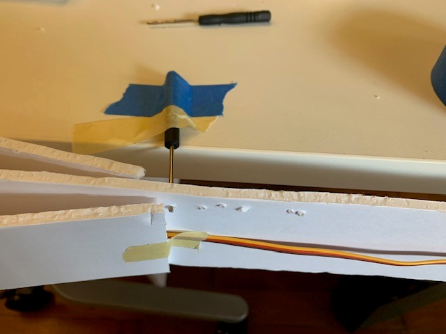

This is a close up of this interesting system.

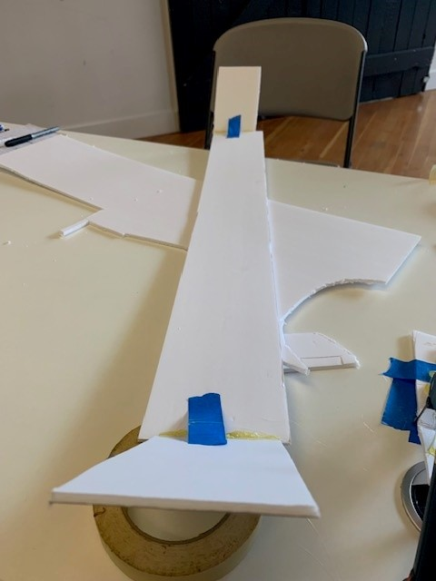

This is an image of the wing to this glider, this wing was diffucilt to design, as angles are everything when dealing with an airplane with dihedral. The blue tape is there to hold the end panels at the proper angles while the glue dries.

And once everything has dried, it is done. 
